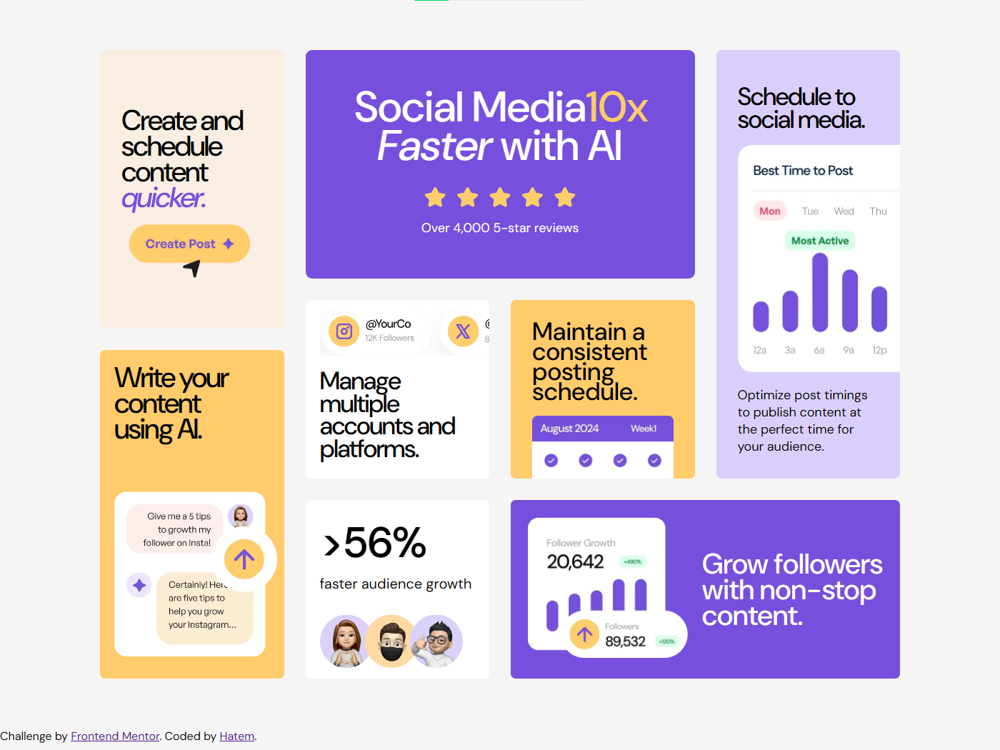

# Bento Grid | Frontend Mentor Challenge

A desktop-first implementation of the **Bento Grid** challenge from Frontend Mentor. This project focuses on building a complex card-based layout using modern CSS layout techniques while maintaining clean, readable, and organized code.

The primary objective of this project was to replace traditional positioning techniques with **CSS Grid** for page layout and **Flexbox** for component alignment.

---

## 📸 Preview



---

## 🛠️ Built With

* HTML5
* CSS3
* CSS Grid
* Flexbox
* Google Fonts (DM Sans)

---

## ✨ Features

* Desktop-first Bento Grid layout
* CSS Grid for the overall page structure
* Flexbox for internal component alignment
* Semantic HTML5 structure
* Modern card-based user interface
* Organized and maintainable CSS architecture
* Image overflow effects using `overflow: hidden`

---

## 📚 What I Learned

This project significantly improved my understanding of modern CSS layout techniques.

During development I learned how to:

* Build complex page layouts using CSS Grid.
* Position components with `grid-column` and `grid-row`.
* Use Flexbox to align content inside individual cards.
* Create scalable layouts without relying on `position` or large margin values.
* Control overflowing images using `overflow: hidden`.
* Structure CSS in a cleaner and more maintainable way.

One of the biggest lessons from this project was understanding the different responsibilities of CSS Grid and Flexbox:

* **CSS Grid** controls the overall page layout.
* **Flexbox** controls the alignment of content inside each component.

---

## 📂 Project Structure

```text
.
├── images/
├── index.html
├── style.css
├── preview.png
└── README.md
```

---

## 🚀 Getting Started

Clone the repository:

```bash
git clone https://github.com/your-username/bento-grid.git
```

Navigate to the project folder:

```bash
cd bento-grid
```

Open `index.html` directly in your browser, or run the project using the Live Server extension in Visual Studio Code.

---

## 🔮 Future Improvements

* Add a fully responsive layout.
* Improve accessibility.
* Refactor repeated values using CSS custom properties.
* Improve typography scaling with `clamp()`.
* Add animations and subtle hover interactions.

---

## 🙏 Acknowledgements

* Challenge by Frontend Mentor.
* Design provided by Frontend Mentor.
* Built by **Hatem**.
